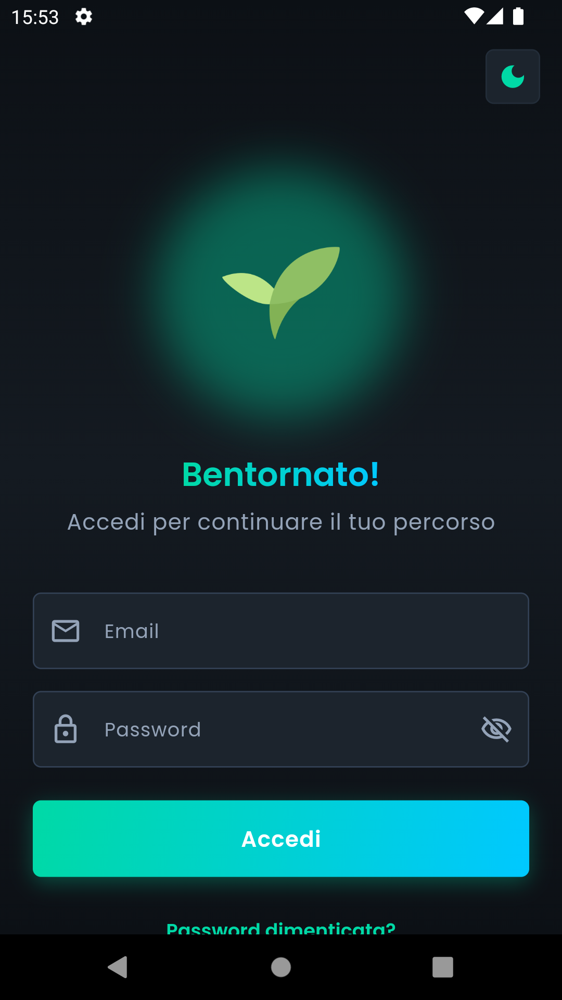
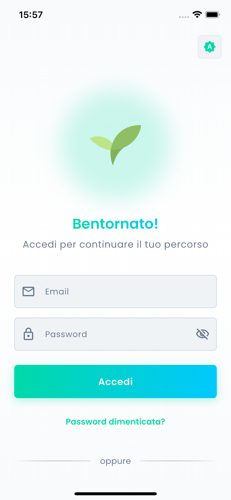

<p align="center">
  
</p>

<h1 align="center">Corpo Sostenibile</h1>

<p align="center">
  <strong>App Mobile per il Centro Online di Nutrizione Integrativa</strong><br/>
  <em>Design "Biohacking Tech" - Moderno, Futuristico, Innovativo</em>
</p>

<p align="center">
  
  
  
  
</p>

---

## Descrizione

Applicazione Flutter cross-platform (iOS/Android) per la gestione del percorso di benessere e nutrizione degli utenti di **Corpo Sostenibile**, il #1 Centro Online di Nutrizione Integrativa.

L'app adotta un **design "Biohacking Tech"** che unisce il mondo del benessere alla tecnologia d'avanguardia, comunicando innovazione, precisione scientifica e un approccio futuristico alla salute.

### Funzionalità Principali

- **Dashboard Interattiva** - Panoramica completa del percorso di benessere
- **Piano Alimentare** - Visualizzazione e tracking del piano personalizzato
- **Tracciamento Progressi** - Grafici e statistiche settimanali
- **Chat con Professionisti** - Comunicazione diretta con nutrizionisti e coach
- **Assistente AI Integrato** - Chatbot intelligente per supporto immediato
- **Profilo Utente** - Gestione dati personali e preferenze
- **Tema Chiaro/Scuro** - Supporto completo per entrambe le modalità

---

## Screenshots

L'app supporta sia **Light Mode** che **Dark Mode**. Di seguito alcuni screenshot dalle versioni Android (Dark Mode) e iOS (Light Mode).

### Android (Dark Mode)

<p align="center">
  
  
  
  
</p>

<p align="center">
  
  
  
</p>

### iOS (Light Mode)

<p align="center">
  
  
  
  
</p>

<p align="center">
  
  
  
</p>

---

## UI/UX Design Philosophy: Biohacking Tech

Il design dell'app è stato completamente ripensato per riflettere l'identità di una **tech company futuristica** nel settore del benessere. Ogni scelta visiva comunica innovazione, precisione e un approccio scientifico alla salute.

### Filosofia del Design

L'obiettivo è trasmettere che **Corpo Sostenibile non è solo un centro di nutrizione**, ma un ecosistema tecnologico avanzato dove scienza, dati e intelligenza artificiale lavorano insieme per ottimizzare il benessere dell'utente.

### Scelte di Design e Motivazioni

#### 1. Animazione Heartbeat (Battito Cardiaco)

**Cosa**: L'animazione della splash screen presenta il logo che pulsa con un effetto **"lub-dub"** realistico — due pulsazioni ravvicinate seguite da una pausa, ripetute 3 volte.

**Perché è Futuristico**:
- Il battito cardiaco è il **simbolo universale della vita e della vitalità** — core del biohacking
- Evoca i **monitor cardiaci** e la tecnologia medica avanzata
- Comunica che l'app "prende vita" e si connette con l'utente a livello biologico
- Richiama il concetto di **quantified self** — monitorare i propri parametri vitali
- Crea un legame emotivo immediato: l'app "ha un cuore" che batte per l'utente

#### 2. Palette Colori Neon

**Cosa**: Utilizzo di colori neon vibranti (verde, blu, arancione, viola) con effetti glow su sfondo scuro.

| Colore | Hex | Significato |
|--------|-----|-------------|
| **Neon Green** | `#39FF14` | Vitalità, crescita, dati bio |
| **Neon Blue** | `#00D4FF` | Tecnologia, affidabilità, AI |
| **Neon Orange** | `#FF6B35` | Energia, azione, metabolismo |
| **Neon Purple** | `#BF40BF` | Innovazione, premium, mindfulness |

**Perché è Futuristico**:
- I colori neon sono **iconici della cultura cyberpunk e sci-fi** — rimandano a Blade Runner, Tron, interfacce olografiche
- Il glow effect simula **schermi OLED e interfacce high-tech**
- Comunica **energia e dinamismo** — l'opposto del wellness "zen" tradizionale
- Differenzia il brand dalla concorrenza che usa palette naturali/organiche
- In dark mode, i neon risaltano come **dati su un monitor medico**

#### 3. Forme Angolari (Meno Arrotondate)

**Cosa**: Card e contenitori con angoli più squadrati (`radiusNone` o `radiusSmall`) alternati strategicamente a elementi arrotondati.

**Perché è Futuristico**:
- Gli angoli squadrati evocano **precisione ingegneristica e rigore scientifico**
- Richiamano l'estetica di **interfacce militari, dashboard di controllo, HUD**
- Comunicano **efficienza e professionalità** — niente fronzoli
- Creano un contrasto visivo che **guida l'occhio** verso le informazioni importanti
- L'alternanza squadrato/arrotondato crea **gerarchia visiva** e ritmo

#### 4. TopBar con Glassmorphism (Blur Trasparente)

**Cosa**: La barra di navigazione superiore presenta un effetto **blur/frost** con trasparenza, permettendo di vedere il contenuto che scorre sotto.

**Perché è Futuristico**:
- Il **glassmorphism** è un trend UI delle interfacce più moderne (iOS, Windows 11, visionOS)
- Evoca **vetro high-tech, visori AR/VR, interfacce olografiche**
- Crea sensazione di **profondità e stratificazione** — l'UI sembra tridimensionale
- Comunica **trasparenza e apertura** — niente è nascosto all'utente
- Il blur dinamico mostra che l'app è **tecnicamente avanzata** (richiede GPU rendering)

#### 5. Effetti Glow e Ombre Neon

**Cosa**: Gli elementi interattivi (chip, bottoni, card) presentano un sottile effetto **glow/shadow** colorato che li fa sembrare illuminati dall'interno.

**Perché è Futuristico**:
- Simula **LED e illuminazione ambientale** — come dispositivi tech premium
- Crea l'illusione che l'interfaccia sia **retroilluminata**
- Guida l'attenzione verso gli **elementi interattivi**
- Aggiunge **profondità visiva** senza appesantire il design
- Evoca **schermi di controllo di astronavi/laboratori** del futuro

### Impatto sulla User Experience

| Elemento | Effetto Psicologico |
|----------|---------------------|
| Heartbeat Animation | Connessione emotiva, fiducia, "l'app è viva" |
| Colori Neon | Energia, innovazione, differenziazione |
| Forme Angolari | Professionalità, precisione, affidabilità |
| Glassmorphism | Modernità, trasparenza, tecnologia avanzata |
| Effetti Glow | Premium feel, attenzione guidata, futurismo |

### Risultato Finale

L'utente percepisce **Corpo Sostenibile** non come una semplice app di nutrizione, ma come un **sistema tecnologico avanzato** — come se stesse interagendo con l'interfaccia di una startup della Silicon Valley o di un laboratorio di biotecnologia del futuro.

Questo posizionamento:
- **Giustifica un pricing premium**
- **Differenzia dalla concorrenza** (app wellness tradizionali)
- **Attrae un target tech-savvy** interessato al biohacking
- **Comunica competenza scientifica** attraverso il design

---

## Assistente AI - Integrazione Gemini

L'app include un **Assistente AI completamente funzionante** basato su Google Gemini. L'assistente è in grado di:

- Rispondere a domande su nutrizione e benessere
- Fornire consigli personalizzati utilizzando il nome dell'utente
- Supportare la formattazione Markdown (**grassetto**, *corsivo*, liste)
- Mantenere il contesto della conversazione durante la sessione

### Configurazione

L'API key **non è inclusa nel codice sorgente** per motivi di sicurezza. Viene gestita tramite un file `secrets.dart` che è escluso da git.

### Come Configurare l'API Key

1. Vai su [Google AI Studio](https://aistudio.google.com/apikey)
2. Accedi con il tuo account Google
3. Clicca su "Create API Key"
4. Copia il file template e inserisci la tua chiave:

```bash
# Copia il template
cp lib/core/config/secrets.example.dart lib/core/config/secrets.dart

# Modifica secrets.dart e inserisci la tua API key
```

Il file `secrets.dart` è automaticamente ignorato da git per proteggere le credenziali.

> **Nota**: La API key gratuita ha dei limiti di utilizzo (richieste al minuto/giorno). Per uso in produzione, considera un piano a pagamento.

### Build

```bash
# Debug
flutter run

# Release APK
flutter build apk --release

# Release iOS
flutter build ios --release
```

> **Sicurezza**: Il file `secrets.dart` non viene mai committato nel repository.

### Personalizzazione del Prompt

Il `systemPrompt` definisce il comportamento dell'assistente. Puoi personalizzarlo per:

- Cambiare il tono delle risposte
- Aggiungere/rimuovere argomenti trattabili
- Modificare i riferimenti ai professionisti del team
- Adattare le linee guida al tuo caso d'uso

### Modelli Disponibili

| Modello | Descrizione |
|---------|-------------|
| `gemini-flash-latest` | Veloce e leggero (consigliato) |
| `gemini-pro` | Più potente, risposte elaborate |
| `gemini-2.0-flash` | Ultima versione Flash |

---

## Design del Logo e Animazione

### Ricostruzione Logo da PNG a SVG

Il logo originale era disponibile solo in formato PNG. È stato **ricostruito manualmente in formato SVG** per garantire:

- Scalabilità perfetta su tutti i dispositivi
- Dimensioni file ridotte
- Possibilità di animazione
- Nitidezza su schermi Retina/HiDPI

<p align="center">
  
</p>

Il processo ha richiesto:
1. Analisi delle forme geometriche del logo originale
2. Ricostruzione dei path vettoriali
3. Ottimizzazione dei tracciati per dimensioni minime
4. Test su diverse risoluzioni e dimensioni

### Animazione Splash Screen

L'animazione della splash screen è stata progettata utilizzando **Rive** come strumento di prototipazione per definire:

- Timing e easing delle transizioni
- Sequenza di apparizione degli elementi
- Effetto di "crescita" organica del logo

<p align="center">
  
</p>

Successivamente, l'animazione è stata **reimplementata nativamente in Flutter** con un effetto **Heartbeat (Battito Cardiaco)**:

**Sequenza Animazione:**
1. **Apparizione foglie** (3s) — Le 3 foglie del logo appaiono in sequenza con effetto `elasticOut`
2. **Heartbeat** (4.5s) — Il logo pulsa con 3 battiti realistici:
   - **LUB**: pulsazione forte (scala 1.0 → 1.15 → 1.0)
   - **DUB**: pulsazione più debole (scala 1.0 → 1.08 → 1.0)
   - **Pausa** prima del battito successivo

**Implementazione tecnica:**
- `AnimationController` per il controllo preciso del timing
- `Transform.scale` per l'effetto zoom fluido
- `Curves.easeOut/easeIn` per simulare la contrazione cardiaca
- Parsing SVG per animare i singoli path delle foglie

**Perché il Heartbeat:**
- Simboleggia **vita, vitalità e connessione biologica**
- Evoca il **biohacking** e il monitoraggio dei parametri vitali
- Crea un **legame emotivo** immediato con l'utente
- Comunica che l'app è **viva e reattiva**

Questo approccio garantisce:
- Performance ottimali (no dipendenze esterne runtime)
- Controllo completo sull'animazione
- Dimensioni bundle ridotte

---

## Architettura

Il progetto segue i principi della **Clean Architecture** con **Riverpod** per lo state management.

Per una descrizione dettagliata dell'architettura e dei pattern utilizzati, consulta la [documentazione tecnica](docs/ARCHITECTURE.md).

**Caratteristiche principali:**

- Separazione delle responsabilità in 3 layer (Data, Domain, Presentation)
- State management reattivo e testabile con Riverpod
- Dependency Injection per mockabilità nei test
- Pattern immutabile per la gestione dello stato

### Struttura del Progetto

```
lib/
├── config/                    # Configurazioni app
│   ├── routes/               # Routing (go_router)
│   └── theme/                # Tema e design system
│
├── core/                      # Elementi condivisi
│   ├── constants/            # Costanti globali
│   ├── errors/               # Gestione errori
│   ├── network/              # Client API (Dio)
│   ├── services/             # Servizi (Gemini AI)
│   ├── utils/                # Utility functions
│   └── widgets/              # Widget riutilizzabili
│
├── features/                  # Feature dell'app (per modulo)
│   ├── auth/                 # Autenticazione
│   ├── home/                 # Home/Dashboard + AI Chat
│   ├── progress/             # Tracciamento progressi
│   ├── chat/                 # Chat con professionisti
│   └── professionals/        # Team e appuntamenti
│
└── main.dart                  # Entry point
```

---

## Stack Tecnologico

| Categoria | Tecnologia |
|-----------|------------|
| **Framework** | Flutter 3.29+ |
| **State Management** | Riverpod 2.x |
| **Routing** | go_router |
| **HTTP Client** | Dio + Retrofit |
| **AI Integration** | Google Generative AI (Gemini) |
| **Storage Sicuro** | flutter_secure_storage |
| **Serializzazione** | freezed + json_serializable |
| **UI Components** | Material 3 + Custom Widgets |
| **Testing** | flutter_test + mocktail |

---

## Testing

Il progetto include una suite di **54 test** che coprono le funzionalità principali:

```bash
# Esegui tutti i test
flutter test

# Esegui test con output dettagliato
flutter test --reporter=expanded
```

### Struttura Test

```
test/
├── core/
│   └── utils/
│       └── markdown_parser_test.dart    # 30 test
│
├── features/
│   └── home/
│       └── presentation/
│           └── providers/
│               └── ai_chat_provider_test.dart  # 23 test
│
└── widget_test.dart                      # 1 test
```

### Test Copertura

| Componente | Test | Descrizione |
|------------|------|-------------|
| **MarkdownParser** | 30 | Parser markdown per formattazione testo AI |
| **AIChatNotifier** | 23 | State management chat AI con mock |
| **Widget App** | 1 | Verifica avvio app |

### MarkdownParser Tests

Test completi per il parser markdown che gestisce le risposte dell'AI:

- **Testo semplice** - Stringhe senza formattazione
- **Bold** (`**text**`) - Singoli e multipli
- **Italic** (`*text*`) - Singoli e multipli
- **Code** (`` `text` ``) - Inline code
- **Headers** (`#`, `##`, `###`) - Titoli e sottotitoli
- **Liste** (`* item`) - Bullet points
- **Citazioni** (`> text`) - Blockquotes
- **Code blocks** (` ``` `) - Blocchi codice
- **Pattern rotti** - Gestione asterischi orfani
- **Casi reali** - Risposte complete da Gemini

### AIChatNotifier Tests

Test con **mock di GeminiService** usando mocktail:

- **Stato iniziale** - Messaggi vuoti, isTyping false
- **setUserName** - Impostazione e aggiornamento nome
- **sendMessage** - Invio messaggi, risposte AI, gestione errori
- **isTyping** - Stato durante richiesta async
- **resetChat** - Reset conversazione
- **Timestamp** - Ordine cronologico messaggi

### Esempio Test con Mock

```dart
class MockGeminiService extends Mock implements GeminiService {}

test('aggiunge risposta AI alla lista', () async {
  when(() => mockGeminiService.sendMessage(
    any(),
    userName: any(named: 'userName'),
  )).thenAnswer((_) async => 'Ciao! Come posso aiutarti?');

  await notifier.sendMessage('Ciao');

  expect(notifier.state.messages.length, 2);
  expect(notifier.state.messages[1].text, 'Ciao! Come posso aiutarti?');
  expect(notifier.state.messages[1].isUser, isFalse);
});
```

---

## Download e Installazione App

I file di installazione precompilati sono disponibili su richiesta (non inclusi nel repository per motivi di sicurezza API key).

| Piattaforma | File | Dimensione |
|-------------|------|------------|
| **Android** | `CorpoSostenibile.apk` | ~24 MB |
| **iOS** | `CorpoSostenibile.ipa` | ~24 MB |

> **Per ottenere i file**: Contatta l'autore o compila l'app seguendo le istruzioni nella sezione [Installazione](#installazione).

### Installazione Android (APK)

1. **Ottieni** il file `CorpoSostenibile.apk` (contatta l'autore o compila l'app)
2. **Trasferisci** il file sul tuo dispositivo Android (via USB, email, cloud, ecc.)
3. **Abilita** l'installazione da origini sconosciute:
   - Vai in *Impostazioni > Sicurezza > Origini sconosciute* (o *Installa app sconosciute*)
   - Abilita per il file manager o browser che userai
4. **Apri** il file APK e segui le istruzioni di installazione
5. **Avvia** l'app "Corpo Sostenibile"

### Installazione iOS (IPA)

L'IPA non è firmato con un certificato Apple. Per installarlo hai diverse opzioni:

#### Opzione 1: AltStore (Consigliata)
1. Installa [AltStore](https://altstore.io/) sul tuo Mac/PC
2. Collega il tuo iPhone via USB
3. Usa AltStore per installare il file `.ipa`
4. L'app sarà valida per 7 giorni, poi dovrai reinstallarla

#### Opzione 2: Sideloadly
1. Scarica [Sideloadly](https://sideloadly.io/)
2. Collega iPhone via USB
3. Trascina il file `.ipa` in Sideloadly
4. Inserisci il tuo Apple ID
5. Installa

#### Opzione 3: Xcode (per sviluppatori)
1. Apri il progetto in Xcode
2. Collega il dispositivo
3. Seleziona il tuo team di sviluppo
4. Esegui `flutter run --release`

> **Nota**: Per iOS, l'app installata tramite sideloading richiede che il dispositivo sia in *Modalità Sviluppatore* (iOS 16+) e che l'app sia "fidata" in *Impostazioni > Generali > Gestione dispositivo*.

---

## Requisiti

- Flutter SDK >= 3.7.2
- Dart SDK >= 3.7.2
- Xcode 15+ (per iOS)
- Android Studio (per Android)
- API Key Google AI Studio (per Assistente AI)

---

## Installazione

1. **Clona il repository**
   ```bash
   git clone git@github.com:Spettacolo83/CorpoSostenibile_Flutter.git
   cd CorpoSostenibile_Flutter
   ```

2. **Installa le dipendenze**
   ```bash
   flutter pub get
   ```

3. **Configura la API Key Gemini**
   ```bash
   # Modifica lib/core/services/gemini_service.dart
   # Inserisci la tua API key
   ```

4. **Genera il codice (models, providers)**
   ```bash
   flutter pub run build_runner build --delete-conflicting-outputs
   ```

5. **Esegui l'app**
   ```bash
   flutter run
   ```

---

## Comandi Utili

```bash
# Analisi statica del codice
flutter analyze

# Esegui test
flutter test

# Build release Android
flutter build apk --release

# Build release iOS
flutter build ios --release

# Generazione continua del codice
flutter pub run build_runner watch
```

---

## Design System

L'app utilizza un design system **"Biohacking Tech"** basato su Material 3 con personalizzazioni per un look futuristico.

### Palette Colori — Neon Tech

| Colore | Hex | Utilizzo | Psicologia |
|--------|-----|----------|------------|
| **Primary** | `#00C896` | Brand principale, successo | Vitalità, crescita, salute |
| **Neon Green** | `#39FF14` | Accenti, dati bio | Energia, natura tech |
| **Neon Blue** | `#00D4FF` | AI, tecnologia | Affidabilità, innovazione |
| **Neon Orange** | `#FF6B35` | CTA, warning | Azione, metabolismo |
| **Neon Purple** | `#BF40BF` | Premium, mindfulness | Mistero, trasformazione |
| **Background Dark** | `#0D1F1A` | Sfondo dark mode | Profondità, focus |

### Filosofia dei Colori

I colori neon su sfondo scuro:
- Evocano **interfacce sci-fi** e dashboard mediche
- Creano **contrasto elevato** per leggibilità
- Comunicano **energia e innovazione**
- Si distinguono dal wellness tradizionale (palette naturali/pastello)

### Forme e Angoli

| Elemento | Stile | Motivazione |
|----------|-------|-------------|
| Card dati/statistiche | **Squadrato** | Precisione, rigore scientifico |
| Card contenuto | **Arrotondato** | Accoglienza, contenuto human |
| Chip/Tag | **Bordo neon** | Focus, selezione tech |
| Bottoni primari | **Semi-arrotondato** | Equilibrio tra tech e usabilità |

### Effetti Visivi

- **Glassmorphism TopBar** — Blur trasparente per effetto vetro hi-tech
- **Neon Glow** — Ombre colorate per elementi interattivi
- **Gradient sottili** — Profondità senza appesantire

### Tipografia

- **Font principale**: Poppins (Google Fonts) — Geometrico, moderno
- **Font secondario**: Quicksand — Splash screen, logo
- Supporto completo per tema chiaro/scuro

---

## Roadmap

- [x] Setup progetto e architettura Clean
- [x] Configurazione tema e design system (Light/Dark)
- [x] Splash screen con animazione logo
- [x] Sistema di autenticazione (UI)
- [x] Home page con dashboard interattiva
- [x] Sezione Progressi con grafici
- [x] Chat con professionisti
- [x] Pagina Team con profili
- [x] Profilo utente
- [x] **Assistente AI con Gemini** (funzionante)
- [x] **Unit Test** (54 test con mocktail)
- [x] **UI/UX Redesign "Biohacking Tech"**
  - [x] Animazione Heartbeat (battito cardiaco)
  - [x] Palette colori Neon
  - [x] Forme angolari/squadrate
  - [x] TopBar Glassmorphism (blur trasparente)
  - [x] Effetti Glow neon
- [ ] Autenticazione backend JWT/OAuth2
- [ ] Integrazione API REST
- [ ] Sistema notifiche push
- [ ] Calendario appuntamenti

---

## Autore

Sviluppato da **Stefano Russello** come demo di competenze Flutter Developer.

### Competenze Dimostrate

- **Flutter/Dart** - Sviluppo cross-platform avanzato
- **Clean Architecture** - Strutturazione scalabile del codice
- **State Management** - Riverpod per gestione stato reattiva
- **AI Integration** - Integrazione API Google Gemini
- **Testing** - Unit test con mocktail, dependency injection
- **UI/UX Design** - Design system "Biohacking Tech", futuristico e moderno
  - Glassmorphism, effetti neon, animazioni custom
  - Psicologia del colore applicata al wellness tech
  - Gerarchia visiva con forme angolari/arrotondate
- **Motion Design** - Animazione Heartbeat con timing realistico
- **Graphic Design** - Ricostruzione logo PNG→SVG, parsing SVG per animazione

---

<p align="center">
  <i>Mockup realizzato per dimostrazione competenze Flutter Developer</i>
</p>

<p align="center">
  
</p>
