<p align="center">
  
</p>

<h1 align="center">Corpo Sostenibile</h1>

<p align="center">
  <strong>App Mobile per il Centro Online di Nutrizione Integrativa</strong>
</p>

<p align="center">
  
  
  
  
</p>

---

## Descrizione

Applicazione Flutter cross-platform (iOS/Android) per la gestione del percorso di benessere e nutrizione degli utenti di **Corpo Sostenibile**, il #1 Centro Online di Nutrizione Integrativa.

### Funzionalità Principali

- **Dashboard Interattiva** - Panoramica completa del percorso di benessere
- **Piano Alimentare** - Visualizzazione e tracking del piano personalizzato
- **Tracciamento Progressi** - Grafici e statistiche settimanali
- **Chat con Professionisti** - Comunicazione diretta con nutrizionisti e coach
- **Assistente AI Integrato** - Chatbot intelligente per supporto immediato
- **Profilo Utente** - Gestione dati personali e preferenze
- **Tema Chiaro/Scuro** - Supporto completo per entrambe le modalità

---

## Screenshots

L'app supporta sia **Light Mode** che **Dark Mode**. Di seguito alcuni screenshot dalle versioni Android (Dark Mode) e iOS (Light Mode).

### Android (Dark Mode)

<p align="center">
  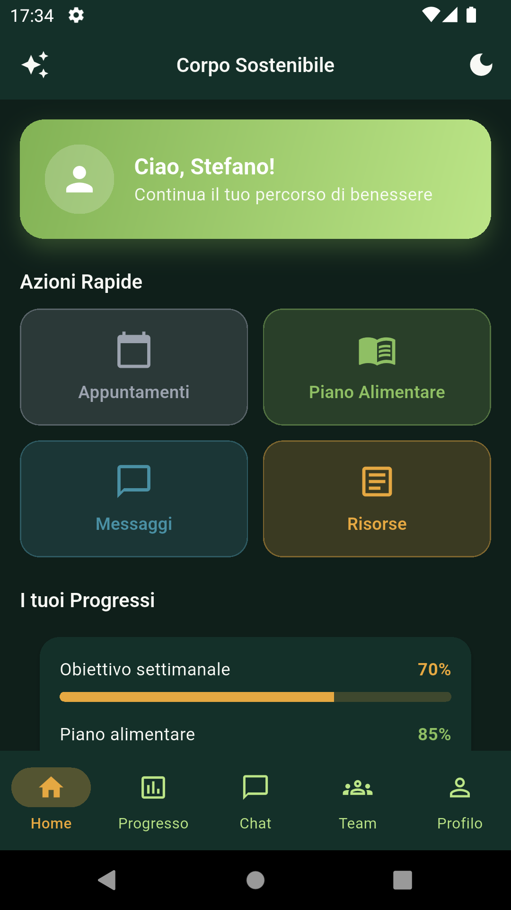
  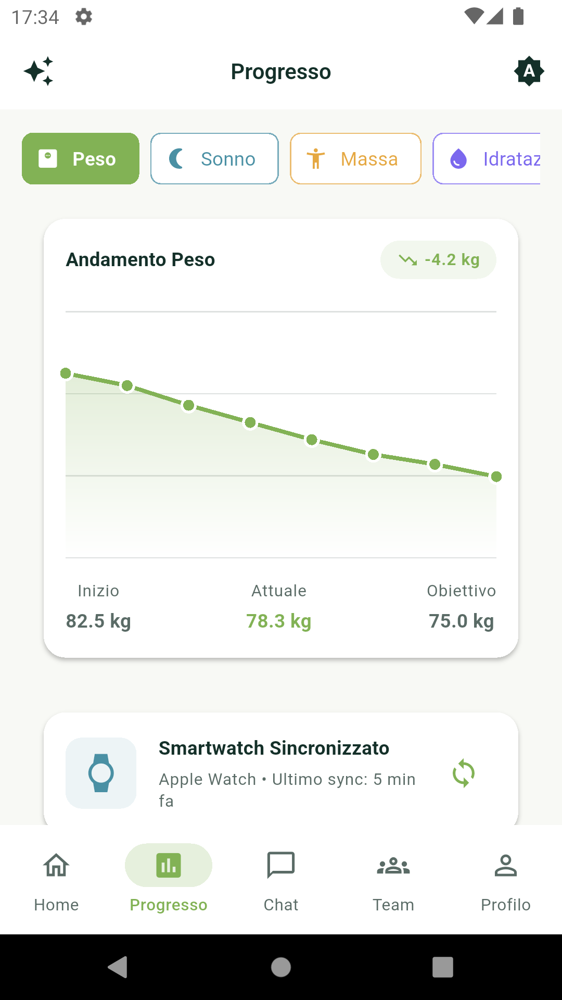
  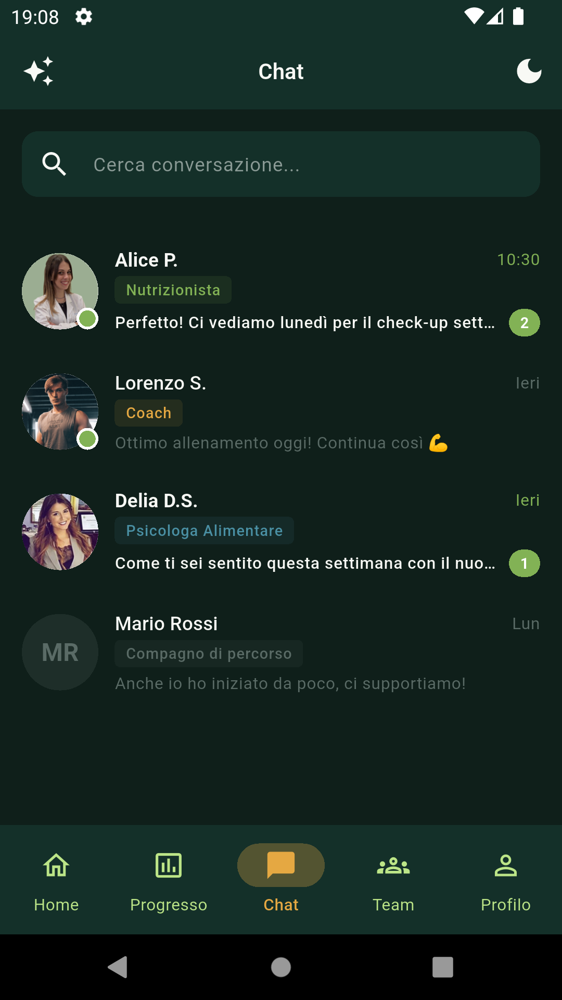
  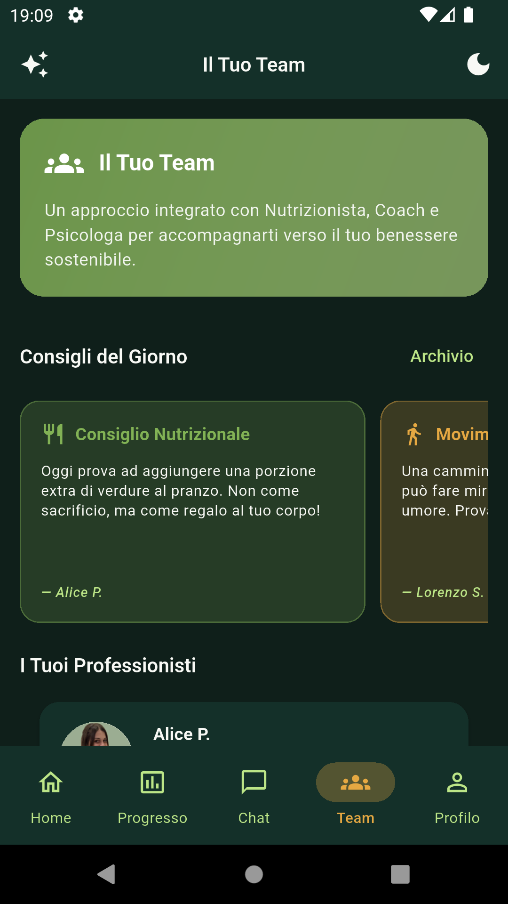
</p>

<p align="center">
  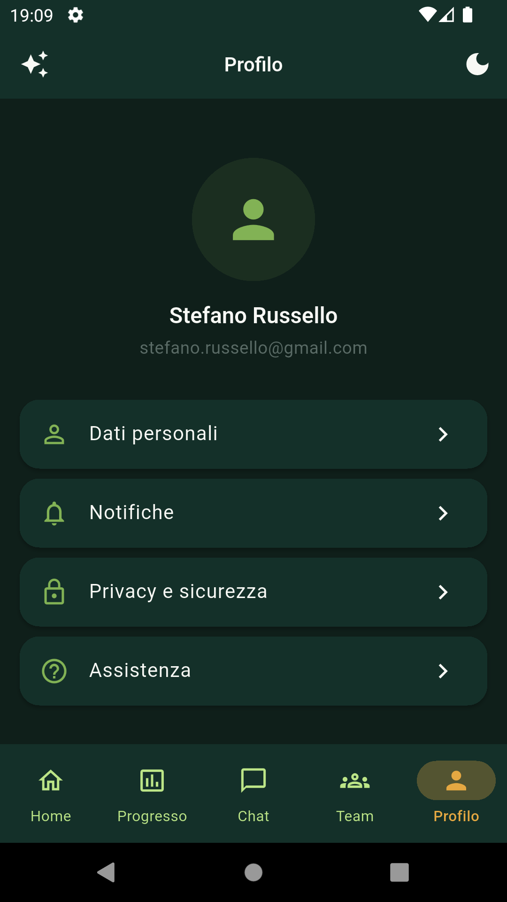
  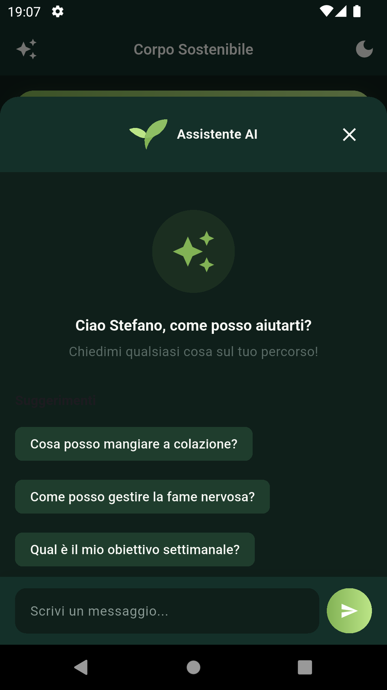
</p>

### iOS (Light Mode)

<p align="center">
  
  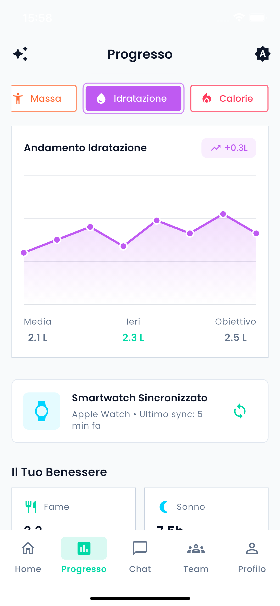
  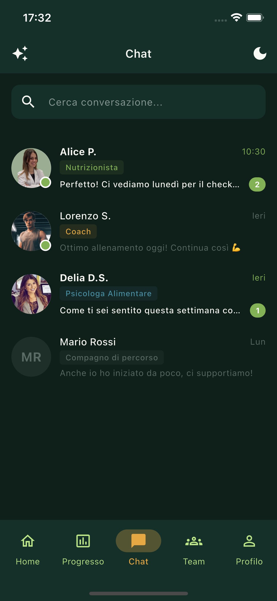
  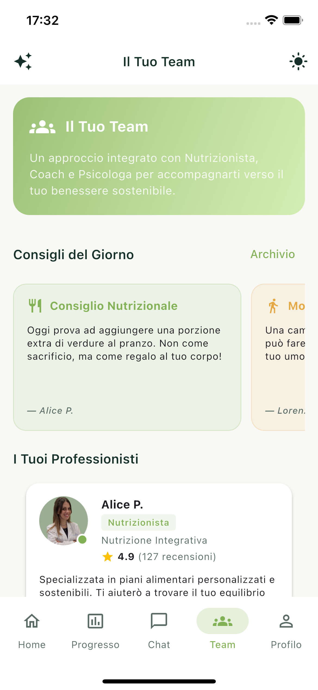
</p>

<p align="center">
  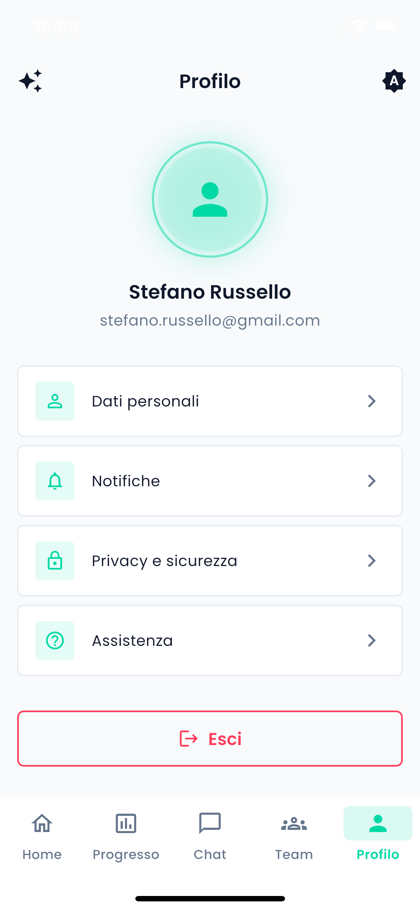
  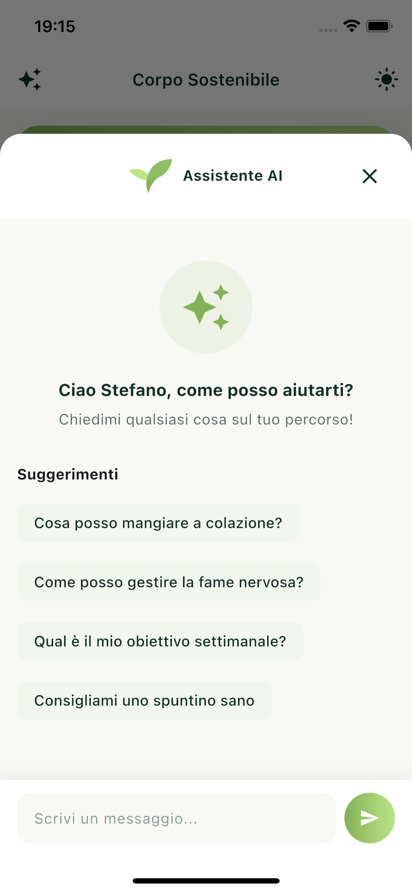
</p>

---

## Assistente AI - Integrazione Gemini

L'app include un **Assistente AI completamente funzionante** basato su Google Gemini. L'assistente è in grado di:

- Rispondere a domande su nutrizione e benessere
- Fornire consigli personalizzati utilizzando il nome dell'utente
- Supportare la formattazione Markdown (**grassetto**, *corsivo*, liste)
- Mantenere il contesto della conversazione durante la sessione

### Configurazione

L'API key **non è inclusa nel codice sorgente** per motivi di sicurezza. Viene passata durante la build tramite `--dart-define`.

### Come Ottenere una API Key Gratuita

1. Vai su [Google AI Studio](https://aistudio.google.com/apikey)
2. Accedi con il tuo account Google
3. Clicca su "Create API Key"
4. Usa la chiave durante la build (vedi sotto)

> **Nota**: La API key gratuita ha dei limiti di utilizzo (richieste al minuto/giorno). Per uso in produzione, considera un piano a pagamento.

### Build con API Key

```bash
# Debug
flutter run --dart-define=GEMINI_API_KEY=your_api_key_here

# Release APK
flutter build apk --release --dart-define=GEMINI_API_KEY=your_api_key_here

# Release iOS
flutter build ios --release --dart-define=GEMINI_API_KEY=your_api_key_here
```

> **Sicurezza**: Non committare mai la API key nel repository. I file APK/IPA nella cartella `releases/` contengono già una API key funzionante.

### Personalizzazione del Prompt

Il `systemPrompt` definisce il comportamento dell'assistente. Puoi personalizzarlo per:

- Cambiare il tono delle risposte
- Aggiungere/rimuovere argomenti trattabili
- Modificare i riferimenti ai professionisti del team
- Adattare le linee guida al tuo caso d'uso

### Modelli Disponibili

| Modello | Descrizione |
|---------|-------------|
| `gemini-flash-latest` | Veloce e leggero (consigliato) |
| `gemini-pro` | Più potente, risposte elaborate |
| `gemini-2.0-flash` | Ultima versione Flash |

---

## Design del Logo e Animazione

### Ricostruzione Logo da PNG a SVG

Il logo originale era disponibile solo in formato PNG. È stato **ricostruito manualmente in formato SVG** per garantire:

- Scalabilità perfetta su tutti i dispositivi
- Dimensioni file ridotte
- Possibilità di animazione
- Nitidezza su schermi Retina/HiDPI

<p align="center">
  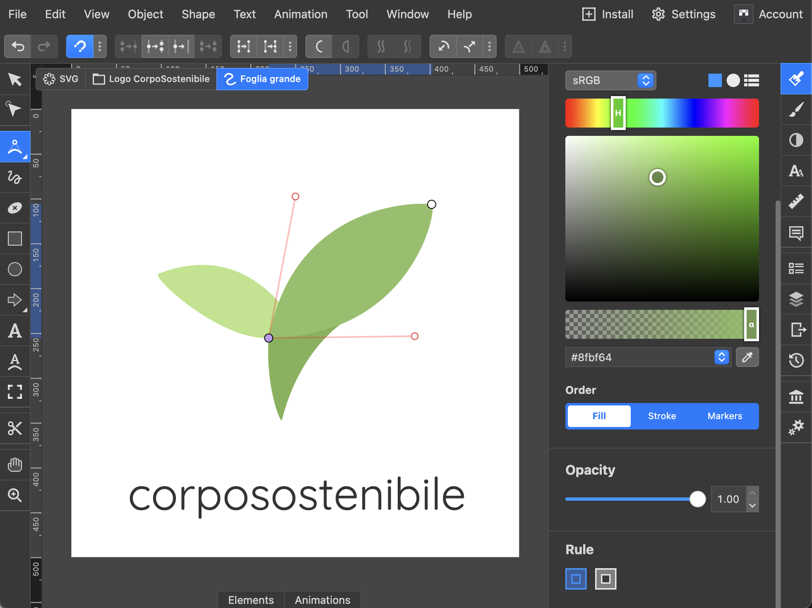
</p>

Il processo ha richiesto:
1. Analisi delle forme geometriche del logo originale
2. Ricostruzione dei path vettoriali
3. Ottimizzazione dei tracciati per dimensioni minime
4. Test su diverse risoluzioni e dimensioni

### Animazione Splash Screen

L'animazione della splash screen è stata progettata utilizzando **Rive** come strumento di prototipazione per definire:

- Timing e easing delle transizioni
- Sequenza di apparizione degli elementi
- Effetto di "crescita" organica del logo

<p align="center">
  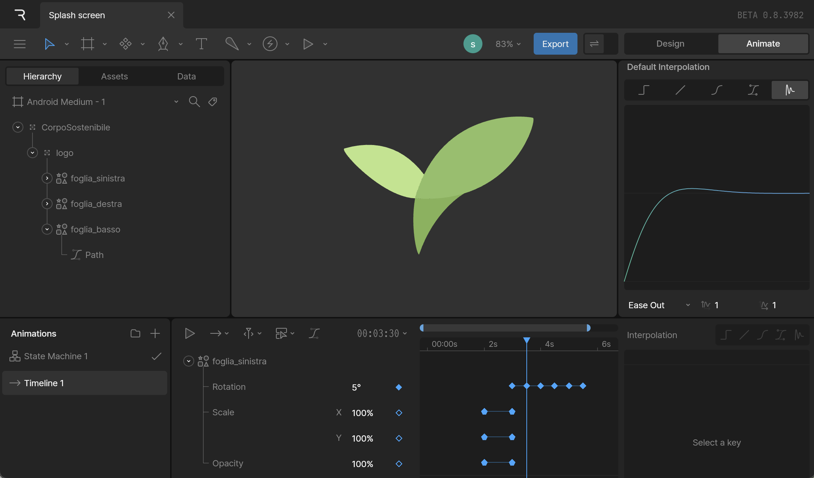
</p>

Successivamente, l'animazione è stata **reimplementata nativamente in Flutter** utilizzando:

- `AnimationController` per il controllo del timing
- `TweenSequence` per transizioni fluide
- `CustomPainter` per il rendering ottimizzato
- Curves personalizzate per un effetto naturale

Questo approccio garantisce:
- Performance ottimali (no dipendenze esterne runtime)
- Controllo completo sull'animazione
- Dimensioni bundle ridotte

---

## Architettura

Il progetto segue i principi della **Clean Architecture** per garantire:

- Separazione delle responsabilità
- Testabilità del codice
- Manutenibilità a lungo termine
- Scalabilità delle funzionalità

### Struttura del Progetto

```
lib/
├── config/                    # Configurazioni app
│   ├── routes/               # Routing (go_router)
│   └── theme/                # Tema e design system
│
├── core/                      # Elementi condivisi
│   ├── constants/            # Costanti globali
│   ├── errors/               # Gestione errori
│   ├── network/              # Client API (Dio)
│   ├── services/             # Servizi (Gemini AI)
│   ├── utils/                # Utility functions
│   └── widgets/              # Widget riutilizzabili
│
├── features/                  # Feature dell'app (per modulo)
│   ├── auth/                 # Autenticazione
│   ├── home/                 # Home/Dashboard + AI Chat
│   ├── progress/             # Tracciamento progressi
│   ├── chat/                 # Chat con professionisti
│   └── professionals/        # Team e appuntamenti
│
└── main.dart                  # Entry point
```

---

## Stack Tecnologico

| Categoria | Tecnologia |
|-----------|------------|
| **Framework** | Flutter 3.29+ |
| **State Management** | Riverpod 2.x |
| **Routing** | go_router |
| **HTTP Client** | Dio + Retrofit |
| **AI Integration** | Google Generative AI (Gemini) |
| **Storage Sicuro** | flutter_secure_storage |
| **Serializzazione** | freezed + json_serializable |
| **UI Components** | Material 3 + Custom Widgets |
| **Testing** | flutter_test + mocktail |

---

## Testing

Il progetto include una suite di **54 test** che coprono le funzionalità principali:

```bash
# Esegui tutti i test
flutter test

# Esegui test con output dettagliato
flutter test --reporter=expanded
```

### Struttura Test

```
test/
├── core/
│   └── utils/
│       └── markdown_parser_test.dart    # 30 test
│
├── features/
│   └── home/
│       └── presentation/
│           └── providers/
│               └── ai_chat_provider_test.dart  # 23 test
│
└── widget_test.dart                      # 1 test
```

### Test Copertura

| Componente | Test | Descrizione |
|------------|------|-------------|
| **MarkdownParser** | 30 | Parser markdown per formattazione testo AI |
| **AIChatNotifier** | 23 | State management chat AI con mock |
| **Widget App** | 1 | Verifica avvio app |

### MarkdownParser Tests

Test completi per il parser markdown che gestisce le risposte dell'AI:

- **Testo semplice** - Stringhe senza formattazione
- **Bold** (`**text**`) - Singoli e multipli
- **Italic** (`*text*`) - Singoli e multipli
- **Code** (`` `text` ``) - Inline code
- **Headers** (`#`, `##`, `###`) - Titoli e sottotitoli
- **Liste** (`* item`) - Bullet points
- **Citazioni** (`> text`) - Blockquotes
- **Code blocks** (` ``` `) - Blocchi codice
- **Pattern rotti** - Gestione asterischi orfani
- **Casi reali** - Risposte complete da Gemini

### AIChatNotifier Tests

Test con **mock di GeminiService** usando mocktail:

- **Stato iniziale** - Messaggi vuoti, isTyping false
- **setUserName** - Impostazione e aggiornamento nome
- **sendMessage** - Invio messaggi, risposte AI, gestione errori
- **isTyping** - Stato durante richiesta async
- **resetChat** - Reset conversazione
- **Timestamp** - Ordine cronologico messaggi

### Esempio Test con Mock

```dart
class MockGeminiService extends Mock implements GeminiService {}

test('aggiunge risposta AI alla lista', () async {
  when(() => mockGeminiService.sendMessage(
    any(),
    userName: any(named: 'userName'),
  )).thenAnswer((_) async => 'Ciao! Come posso aiutarti?');

  await notifier.sendMessage('Ciao');

  expect(notifier.state.messages.length, 2);
  expect(notifier.state.messages[1].text, 'Ciao! Come posso aiutarti?');
  expect(notifier.state.messages[1].isUser, isFalse);
});
```

---

## Download e Installazione App

I file di installazione precompilati sono disponibili su richiesta (non inclusi nel repository per motivi di sicurezza API key).

| Piattaforma | File | Dimensione |
|-------------|------|------------|
| **Android** | `CorpoSostenibile.apk` | ~24 MB |
| **iOS** | `CorpoSostenibile.ipa` | ~24 MB |

> **Per ottenere i file**: Contatta l'autore o compila l'app seguendo le istruzioni nella sezione [Installazione](#installazione).

### Installazione Android (APK)

1. **Ottieni** il file `CorpoSostenibile.apk` (contatta l'autore o compila l'app)
2. **Trasferisci** il file sul tuo dispositivo Android (via USB, email, cloud, ecc.)
3. **Abilita** l'installazione da origini sconosciute:
   - Vai in *Impostazioni > Sicurezza > Origini sconosciute* (o *Installa app sconosciute*)
   - Abilita per il file manager o browser che userai
4. **Apri** il file APK e segui le istruzioni di installazione
5. **Avvia** l'app "Corpo Sostenibile"

### Installazione iOS (IPA)

L'IPA non è firmato con un certificato Apple. Per installarlo hai diverse opzioni:

#### Opzione 1: AltStore (Consigliata)
1. Installa [AltStore](https://altstore.io/) sul tuo Mac/PC
2. Collega il tuo iPhone via USB
3. Usa AltStore per installare il file `.ipa`
4. L'app sarà valida per 7 giorni, poi dovrai reinstallarla

#### Opzione 2: Sideloadly
1. Scarica [Sideloadly](https://sideloadly.io/)
2. Collega iPhone via USB
3. Trascina il file `.ipa` in Sideloadly
4. Inserisci il tuo Apple ID
5. Installa

#### Opzione 3: Xcode (per sviluppatori)
1. Apri il progetto in Xcode
2. Collega il dispositivo
3. Seleziona il tuo team di sviluppo
4. Esegui `flutter run --release`

> **Nota**: Per iOS, l'app installata tramite sideloading richiede che il dispositivo sia in *Modalità Sviluppatore* (iOS 16+) e che l'app sia "fidata" in *Impostazioni > Generali > Gestione dispositivo*.

---

## Requisiti

- Flutter SDK >= 3.7.2
- Dart SDK >= 3.7.2
- Xcode 15+ (per iOS)
- Android Studio (per Android)
- API Key Google AI Studio (per Assistente AI)

---

## Installazione

1. **Clona il repository**
   ```bash
   git clone git@github.com:Spettacolo83/CorpoSostenibile_Flutter.git
   cd CorpoSostenibile_Flutter
   ```

2. **Installa le dipendenze**
   ```bash
   flutter pub get
   ```

3. **Configura la API Key Gemini**
   ```bash
   # Modifica lib/core/services/gemini_service.dart
   # Inserisci la tua API key
   ```

4. **Genera il codice (models, providers)**
   ```bash
   flutter pub run build_runner build --delete-conflicting-outputs
   ```

5. **Esegui l'app**
   ```bash
   flutter run
   ```

---

## Comandi Utili

```bash
# Analisi statica del codice
flutter analyze

# Esegui test
flutter test

# Build release Android
flutter build apk --release

# Build release iOS
flutter build ios --release

# Generazione continua del codice
flutter pub run build_runner watch
```

---

## Design System

L'app utilizza un design system coerente basato su **Material 3**:

### Palette Colori

| Colore | Hex | Utilizzo |
|--------|-----|----------|
| **Primary** | `#143029` | Brand principale, elementi chiave |
| **Primary Light** | `#2E7D32` | Accenti, stati hover |
| **Secondary** | `#FF8F00` | Call-to-action, notifiche |
| **Success** | `#4CAF50` | Conferme, progressi positivi |
| **Warning** | `#FFC107` | Avvisi, attenzione |

### Tipografia

- **Font principale**: Poppins (Google Fonts)
- **Font secondario**: Quicksand
- Supporto completo per tema chiaro/scuro

---

## Roadmap

- [x] Setup progetto e architettura Clean
- [x] Configurazione tema e design system (Light/Dark)
- [x] Splash screen con animazione logo
- [x] Sistema di autenticazione (UI)
- [x] Home page con dashboard interattiva
- [x] Sezione Progressi con grafici
- [x] Chat con professionisti
- [x] Pagina Team con profili
- [x] Profilo utente
- [x] **Assistente AI con Gemini** (funzionante)
- [x] **Unit Test** (54 test con mocktail)
- [ ] Autenticazione backend JWT/OAuth2
- [ ] Integrazione API REST
- [ ] Sistema notifiche push
- [ ] Calendario appuntamenti

---

## Autore

Sviluppato da **Stefano Russello** come demo di competenze Flutter Developer.

### Competenze Dimostrate

- **Flutter/Dart** - Sviluppo cross-platform avanzato
- **Clean Architecture** - Strutturazione scalabile del codice
- **State Management** - Riverpod per gestione stato reattiva
- **AI Integration** - Integrazione API Google Gemini
- **Testing** - Unit test con mocktail, dependency injection
- **UI/UX Design** - Design system coerente, supporto dark mode
- **Graphic Design** - Ricostruzione logo PNG→SVG, animazioni custom

---

<p align="center">
  <i>Mockup realizzato per dimostrazione competenze Flutter Developer</i>
</p>

<p align="center">
  
</p>
